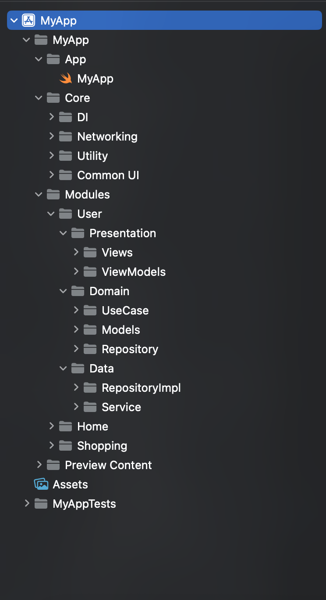
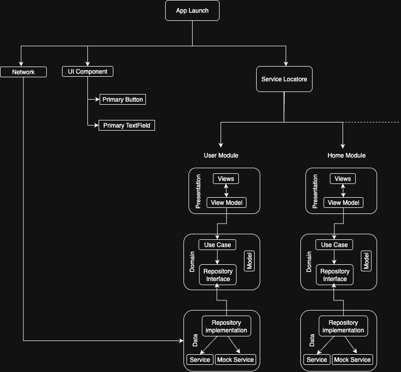

# MyAppSwiftUi
This repository is a reference architecture for building iOS apps with **SwiftUI, MVVM, Clean Architecture, and a Service Locator pattern**.  

It provides flexibility for real-world projects while keeping modules **portable, testable, and easy to maintain**.

---

# iOS Modular MVVM Clean Architecture (SwiftUI)

This project demonstrates how to build an iOS app using **Modular MVVM + Clean Architecture** with a **Service Locator** pattern.  
The goal is to create reusable modules that can be copied into any project, while keeping testability, flexibility, and maintainability in mind.

---

## 🚀 Modular Architecture

We structure the app into independent **modules**.  
Each module contains its own:

- `Presentation` → Views & ViewModels  
- `Domain` → Use Cases & Protocols  
- `Data` → Repository Implementations & Services  

### Why Modular?
- ✅ **Reusable** → A module like `User` can be reused in another project by copying the folder.  
- ✅ **Independent** → Each layer (UI, business logic, data) is separate.  
- ✅ **Scalable** → Large teams can work on different modules without conflicts.  

Example Folder:




---
---

## 🧼 Clean Architecture (Layers)

We follow **Clean Architecture principles**. Here’s a simple explanation of each layer:

- **Presentation Layer**  
  - Contains **SwiftUI Views** and **ViewModels**.  
  - Views show UI and bind to ViewModels.  
  - ViewModels hold UI state and trigger UseCases.  

- **Domain Layer**  
  - The **core business logic**.  
  - Contains **Entities** (pure models) and **UseCases** (operations like Login or Signup).  
  - Completely independent of frameworks (no SwiftUI or networking code here).  

- **Data Layer**  
  - Responsible for fetching and storing data.  
  - Contains **Repositories** (implementing Domain protocols) and **Services** (API, Mock, or Database).  
  - Knows how to talk to the outside world (API, storage).  

### Flow
View → ViewModel → UseCase → Repository (protocol) → RepositoryImpl → Service (Mock/Live)

---

## 🛠 Service Locator with Mock & Live

We use a **Service Locator** to create dependencies and manage environment selection.  

- At app launch (`init`), we decide whether the app runs with **Mock** or **Live** services.  
- From then, every module automatically gets the correct dependency (without rewriting code).  

### Example:

```swift
@main
struct MyApp: App {
    init() {
        // Set environment once at app launch
        ServiceLocator.shared.setEnvironment(.mock) // switch .mock <-> .live
    }

    var body: some Scene {
        WindowGroup {
            ServiceLocator.shared.makeLoginView()
        }
    }
}
```
🌍 Environment Selection
    •    Mock → Useful for Unit Testing, UI Previews, or offline development.
    •    Live → Real API calls in production.

The environment is stored inside the Service Locator, so you can globally configure once and every module respects it.

---

🧭 Simple Navigation

Because the Service Locator builds views with dependencies, navigation becomes one line and three words:
```swift 
ServiceLocator.shared.makeLoginView()
```
This reduces boilerplate and ensures every View has the right ViewModel, UseCase, and Repository injected automatically.

---

🧪 Unit Testing

We include Combine-based unit tests for LoginViewModel and LoginUseCase.

Example LoginViewModelTests.swift:

```swift
func testLoginUpdatesUser() {
    let expectation = XCTestExpectation(description: "Login success updates user")
    
    viewModel.email = "test@gmail.com"
    viewModel.password = "1234"
    
    viewModel.$user
        .dropFirst()
        .sink { user in
            XCTAssertEqual(user?.email, "test")
            expectation.fulfill()
        }
        .store(in: &cancellables)
    
    viewModel.login()
    
    wait(for: [expectation], timeout: 1.0)
}
```

---

📂 Project Structure
```
/MyAppSwiftUi
 ├── Modules
 │   ├── User
 │   │    ├── Presentation
 │   │    ├── Domain
 │   │    └── Data
 │   └── Home (future module)
 ├── Core
 │   ├── ServiceLocator
 │   ├── Networking
 │   └── Utils
 ├── Tests
 │   ├── UserTests
 │   └── CoreTests
 ```
 
---
 
 📸 Diagrams & Screenshots
    •    System Design Diagram




---

✅ Key Takeaways
    •    Modular → Build reusable modules and drop them into other projects.
    •    Clean Architecture → Layers separated for testability and scalability.
    •    Service Locator → Central place for Mock/Live environment switching.
    •    Navigation → Simplified with locator-based view builders.
    •    Testability → Works with Combine + XCTest.

---

📝 Next Steps
    •    Add more modules (Home, Dashboard, Profile).
    •    Support per-module environments (e.g., User = Mock, Home = Live).
    •    Add UI tests and integration tests.

---

⚡️ Summary

This repository is a reference architecture for building iOS apps with SwiftUI, MVVM, Clean Architecture, and a Service Locator pattern.

It shows how to keep modules reusable, testable, and production-ready, while simplifying navigation and environment configuration.

---
---

