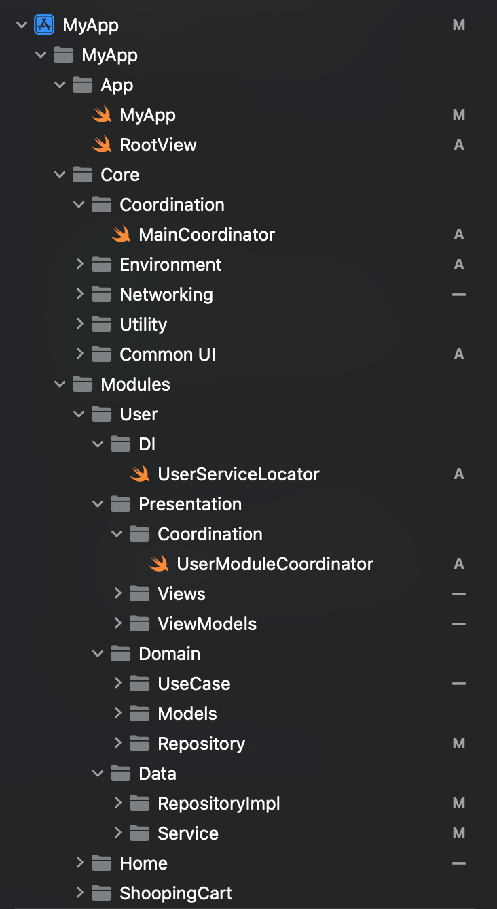

# 📱 iOS Modular App -- MVVM + Coordinator + Clean Architecture

This project demonstrates a **senior-level iOS architecture** using:\
- **MVVM** for presentation\
- **Coordinator pattern** for navigation\
- **Clean Architecture** (Data, Domain, Presentation layers)\
- **Dependency Injection** via `AppDIContainer`\
- **Mock vs Live environments** for easy testing and production

------------------------------------------------------------------------

## 🚀 Features

-   Scalable modular architecture (Product, Cart, Profile, etc.)
-   Coordinators manage navigation
-   Async/await for data fetching
-   Testable with Mock services
-   Follows **SOLID** principles

------------------------------------------------------------------------

## 📂 Project Structure

    ```
App
│
├── MainCoordinator.swift      # Root navigation
├── AppDIContainer.swift       # Dependency Injection container
│
├── Product
│   ├── ProductCoordinator.swift
│   ├── ProductUseCase.swift
│   ├── ProductRepository.swift
│   ├── ProductViewModels.swift
│   └── ProductViews.swift
│
├── Cart
│   ├── CartCoordinator.swift
│   └── ...
│
└── Profile
    ├── ProfileCoordinator.swift
    └── ...
    ```
    ---

## 📂 Folder Structure


---


------------------------------------------------------------------------

## 📝 Documentation

We wrote a detailed Medium article explaining the architecture, module
separation, environment setup (Mock & Live), dependency injection, and
SOLID principles:

👉 [Read the full article on Medium](https://medium.com/@adsurerahul96/building-a-scalable-ios-app-with-mvvm-coordinator-and-clean-architecture-da0be161f2e5)

------------------------------------------------------------------------

## 🛠 Setup

``` bash
git clone https://github.com/dada4747/MyAppSwiftUi.git
cd MyAppSwiftUi
open MyApp.xcodeproj
```

Switch environment (`mock` or `live`) in `AppEnvironment`.

------------------------------------------------------------------------

## 📌 Roadmap

-   [ ] Add Cart module\
-   [ ] Add Profile module\
-   [ ] Add unit tests for UseCases and ViewModels

------------------------------------------------------------------------
🙌 Connect
    •    💬 Have questions? Drop an issue or comment.
    •    📝 Full article with explanation: [Medium Article](https://medium.com/@adsurerahul96/building-a-scalable-ios-app-with-mvvm-coordinator-and-clean-architecture-da0be161f2e5)
    •    🤝 Let’s connect on [LinkedIn](https://www.linkedin.com/in/rahul-adsure-186a9b16a)
    
---

## 📄 License

MIT License

